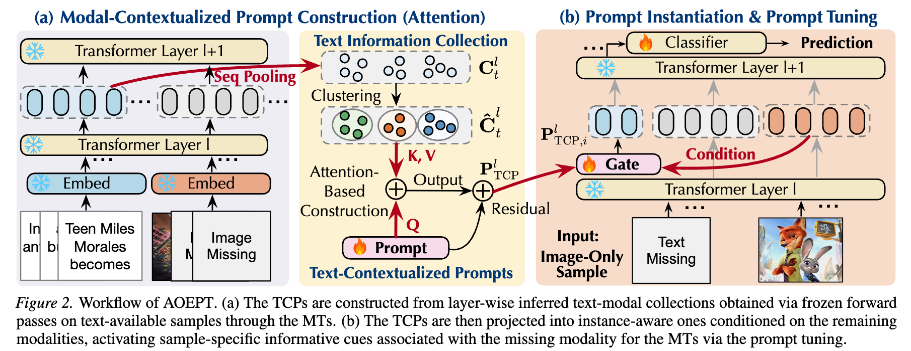
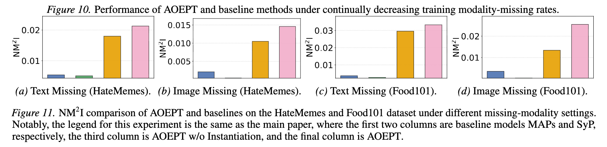

# AOEPT

This repo is the official implementation of `AOEPT: Breaking the Implicit Modality-Reduction Bottleneck in Modality Missing Prompt Tuning` accepted by **ICML 2026**.

Paper Link: https://arxiv.org/abs/2605.24816

> [!IMPORTANT]
>
> *We release the **first comprehensive collection of resources on modality-missing learning**: https://github.com/Jian-Lang/awesome-modality-missing-learning.*

# Abstract

Deploying multimodal systems in real-world environments often entails handling modality-missing scenarios, where one or more modalities are unavailable. While recent studies address this challenge for the general Multimodal Transformer (MT) architecture via prompt tuning, we identify a fundamental limitation in these methods: the Implicit Modality-Reduction bottleneck. By conditioning prompts solely on the observed modalities, they inadvertently restrict the reasoning scope of MTs to the modality-reduced subspace, cutting off access to the latent information sources of the missing modalities. To overcome this limitation, we propose AOEPT, which pioneers a novel modal-contextualized prompting fashion. Specifically, we introduce lightweight Modal-Contextualized Prompts (MCPs) that distill global modality-wise priors from training data, serving as latent repositories of the information sources for missing modalities. Conditioned on the remaining modalities, these MCPs are instantiated into instance-aware prompts that selectively augment missing-modality information for each sample, thereby restoring the reasoning scope of MTs beyond the observed-modality-only subspace. Experiments across various multimodal benchmarks and backbones confirm the strong performance of AOEPT, with minimal computational overhead.

# Framework



## Code Structure

```sh
├── core
│   ├── model
│   │   └──AOEPT    # framework code for AOEPT
│   └── train.py    # training and evaluation script
├── data            # dataset folder
│   ├── food101
│   ├── hatemems
│   └── mmimdb
├── preprocess      # preprocessing scripts
└── script          # script to run
```

## Dataset

### MM-IMDb

First, download the dataset from this link: https://archive.org/download/mmimdb/mmimdb.tar.gz

### HateMemes

Download the dataset from this link: https://www.kaggle.com/datasets/parthplc/facebook-hateful-meme-dataset

Next, replace the **test.json** in metadata with **test_seen.json** downloaded from this link: https://www.kaggle.com/datasets/williamberrios/hateful-memes as the test.json downloaded from the prior website has no label information for evaluation. (Do not change other files, only replace the test.json with test_seen.json)

### Food101

Download the dataset from this link: https://www.kaggle.com/datasets/gianmarco96/upmcfood101

## Run

### Data Preprocess 

```sh
# generate missing tables and preprocess datasets
bash script/run_preprocss.sh
```

### Run AOEPT

```sh
# Run AOEPT CLIP backbone on MM-IMDB dataset with text 70% missing
# NOTE: arch/dataset are case-sensitive and must match the config filenames:
# arch in (CLIP|ViLT), dataset in (Food101|HateMemes|MMIMDB).
bash script/run_aoept.sh CLIP MMIMDB text 0.7
```

## NM2I Diagnosis

We introduce Normalized Missing-modality Mutual Information (NM2I), quantifying how much information the prompt tokens
share with the **ground-truth** latent representations of the
missing modality at each MT layer. NM2I can be leveraged to diagnose the Implicit Modality-Reduction (IMR) bottleneck.



## Citation

If you find the code useful for your research, please give us a star ⭐⭐⭐ and consider citing:

```
@inproceedings{lang2026aoept,
    author = {Lang, Jian and Hong, Rongpei and Zhong, Ting and Zhou, Fan},
    booktitle = {International Conference on Machine Learning (ICML)},
    year = {2026},
    title = {AOEPT: Breaking the Implicit Modality-Reduction Bottleneck in Modality-Missing Prompt Tuning},
}
```